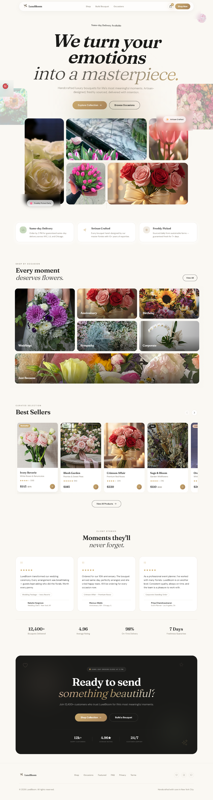

# 💐 LuxeBloom - Luxury Floral E-Commerce Platform

[This Project behance Link](https://www.behance.net/gallery/252167263/LuxeBloom-Luxury-Floral-E-Commerce-Web-App)

A modern, visually immersive e-commerce web application dedicated to ordering premium, handcrafted flower bouquets and custom floral arrangements. Built with performance, fluid user experiences, and dynamic customization in mind.

  

## ✨ Core Features

### 🏠 Curated Storefront & Navigation

- **Immersive Hero Sections:** Cinematic landing page featuring high-definition seasonal banners and fluid transitions.
- **🔥 Bestsellers Hub:** A dedicated showcase highlighting top-rated arrangements and trending collections to drive conversion.

### 🌸 Dynamic Product Customization (Deep Personalization)

- **Reactive Pricing Engine:** Instant, live price calculations adapting to bouquet sizes (`Small` / `12 stems`, `Medium` / `18 stems`, `Large` / `24 stems`) and quantities.
- **Visual Variant Switchers:** Interactive selectors for custom wrap materials (e.g., Ivory Kraft, Blush Pink, Sage Green, Midnight) updating states locally.
- **Personalized Add-ons:** Built-in form handling for custom greeting card messages attached directly to the checkout payload.
- **Fluid Image Gallery:** Interactive thumbnail-to-main view state management for zero-lag close-up inspections.

### 🛒 Global State Shopping Cart System

- **React Context Architecture:** Powered by a persistent React Context (`useCart`) ensuring multi-attribute variants (Size + Wrap type + Gift message) are cleanly cataloged.
- **Asynchronous UX Signals:** Micro-interactions on buttons (e.g., immediate `✓ Added to Cart` UI states) providing robust user feedback loops.

### 📱 Responsive & Accessible UI

- Fully optimized mobile-first layout utilizing strict layout grids and Tailwind CSS spacing scales for desktop, tablet, and mobile views.

---

## 🛠️ Architecture & Tech Stack

- **Framework:** Next.js (App Router, Client/Server Components separation for SEO optimization)
- **Language:** TypeScript (Type-safe component interfaces and data objects)
- **Styling & Design:** Tailwind CSS (Modern token-based layouts with strict hover/active states)
- **State Management:** React Context API (Seamless shopping cart logic, state propagation, and persistence)
- **Media Handling:** Optimally scaled assets utilizing `AppImage` components for responsive layout shifts prevention.

---

## ✒️ Developer

Developed with 🤍 by **Heba ElGohary**

[LinkedIn](https://www.linkedin.com/in/heba-elgohary-a13074167/)
[GitHub](https://github.com/HebaAbdElhamed)
[Behance](https://www.behance.net/hebaabdelhamed1)
